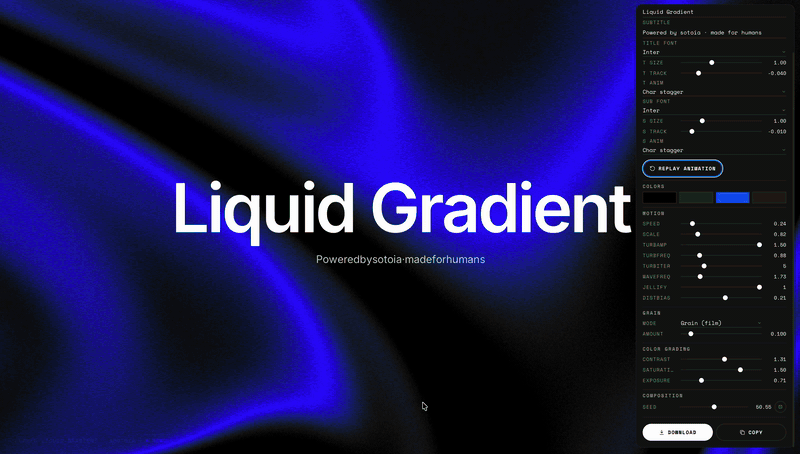

# Liquid Gradient

> The animated WebGL hero you see on Framer Workshop, packaged as a 1-file Studio. Pick fonts, tune the shader, pick an entry animation, hit **Download HTML**. No build step, no dependencies.



A standalone, dependency-free port of the [Framer Workshop](https://www.framer.com/workshop/) "Liquid Gradient" shader (`LiquidGradient.mjs` in their bundle). The original algorithm is by Framer — this repo unpacks it into pure WebGL2 + a Nothing-inspired Studio so you can use it on any website.

## Why this exists

I wanted that exact gradient on a side project. Spent an hour reading Framer's minified bundle, found the `LiquidGradient` shader (PCG hash + Oklab/Lch blending + iterative turbulence + film dither + soft gamut mapping), and realised it'd be a shame to keep it locked behind a `framer.app` URL.

So I unminified it, wrote the rest of the pipeline around it (WebGL2 boilerplate, palette uploader, render loop, React wrapper), and built a tiny Studio so anyone can tune it without reading shader code.

## Try the Studio

```sh
git clone https://github.com/sotoia/liquid-gradient.git
cd liquid-gradient
open demo.html
```

That's it. No npm, no build. The Studio is a single HTML file.

### What's inside the Studio

- **Live text editing** — title + subtitle inputs, plus 10 display fonts and 10 body fonts (Inter, Doto, Bricolage Grotesque, Playfair, Anton, Bebas, IBM Plex, JetBrains Mono, Sora, Manrope…) **+ upload your own** `.woff` / `.woff2` / `.ttf` / `.otf` via FontFace API
- **Typography sliders** — size and letter-spacing for title and subtitle independently
- **8 entry animations** — fade, blur, slide-up, scale, mask reveal, char stagger, word stagger (all easing with Framer's house cubic-bezier)
- **4-color palette** — sampled perceptually in Oklab so mid-tones don't go muddy
- **Every shader uniform** — speed, scale, turbulence amplitude/frequency/octaves, wave frequency, jellify, distribution bias
- **Grain control** — Off / Smooth IGN / Film grain + intensity 0–1
- **Color grading** — contrast, saturation, exposure
- **Seed + random** — re-roll the composition without touching anything else
- **Eye toggle** — collapse the panel out of the way
- **📥 Download as HTML** — exports a self-contained file with your exact settings, animations, fonts, and shader inlined. Drop it on any server.
- **⧉ Copy CONFIG (JSON)** — for pasting into the React component or any framework

## Use it — vanilla HTML

Copy [`standalone.html`](standalone.html) into your project. Edit the `CONFIG` object at the top of the `<script>` block. Done.

```html
<canvas id="liquid"></canvas>
<script>
  const CONFIG = {
    colors: ['#000000', '#2b2b2b', '#384fff', '#212121'],
    speed: 0.24,
    scale: 0.82,
    turbAmp: 1.5,
    dither: 0.10,
    ditherMode: 2,         // 0 off · 1 smooth · 2 grain
    contrast: 1.31,
    saturation: 1.5,
    exposure: 0.71,
    seed: 50.55,
    /* ...all other uniforms */
  };
  /* full shader + render loop already included */
</script>
```

## Use it — React / Next.js

Drop [`react/LiquidGradient.tsx`](react/LiquidGradient.tsx) into your project. Zero dependencies.

```tsx
import { LiquidGradient } from "./LiquidGradient";

export default function Hero() {
  return (
    <section style={{ position: "relative", height: "100vh", background: "#000" }}>
      <LiquidGradient
        colors={["#000000", "#2b2b2b", "#384fff", "#212121"]}
        dither={0.10}
        ditherMode={2}
        contrast={1.31}
        saturation={1.5}
        exposure={0.71}
        seed={50.55}
      />
      <h1 style={{ position: "relative", zIndex: 1 }}>Build in seconds</h1>
    </section>
  );
}
```

The component mounts a full-bleed `<canvas>` (`position: absolute; inset: 0`) inside its parent — make sure the parent has `position: relative` (or any non-static position).

## All props

| Key | Default | Range | What |
|---|---|---|---|
| `colors` | `[#000, #2b2b2b, #384fff, #212121]` | 1–8 hex | Palette sampled in Oklab |
| `speed` | `0.24` | 0–2 | Animation speed |
| `scale` | `0.82` | 0.3–3 | Zoom of the field |
| `turbAmp` | `1.5` | 0–1.5 | Turbulence amplitude |
| `turbFreq` | `0.88` | 0.3–3 | Turbulence frequency |
| `turbIter` | `5` | 2–13 | Octaves (more detail = more GPU) |
| `waveFreq` | `1.73` | 0.5–6 | Wave frequency |
| `jellify` | `1` | 0 \| 1 | Squashes axes for jelly feel |
| `distBias` | `0.21` | -2 to 2 | Distribution bias |
| `dither` | `0.10` | 0–1 | Grain intensity |
| `ditherMode` | `2` | 0 \| 1 \| 2 | `0 off · 1 smooth IGN · 2 grain (film)` |
| `exposure` | `0.71` | 0.3–2 | Brightness |
| `contrast` | `1.31` | 0.5–2 | Contrast |
| `saturation` | `1.5` | 0–2 | Saturation |
| `seed` | `50.55` | any float | Varies composition |
| `loop` | `0` | 0 or seconds | `0` = continuous; `> 0` = seamless loop period |

## File map

| File | What |
|------|------|
| `demo.html` | Full interactive Studio with control panel, font uploader, animations, star-gate. **Start here.** |
| `standalone.html` | Drop-in vanilla version, no UI — just the shader and a `CONFIG` object |
| `react/LiquidGradient.tsx` | React component, TypeScript, zero deps |
| `shader/liquid-gradient.frag` | The fragment shader, readable and fully commented |
| `shader/liquid-gradient.vert` | The (trivial) vertex shader |
| `claude-skill/` | A [Claude Code](https://claude.ai/code) skill so Claude can integrate this into your projects from a vague brief. See [`claude-skill/README.md`](claude-skill/README.md) |

## Use with Claude Code

If you use [Claude Code](https://claude.ai/code), there's a packaged skill in [`claude-skill/`](claude-skill/) that teaches Claude to integrate Liquid Gradient into any project and tune the uniforms from vague briefs:

```sh
git clone https://github.com/sotoia/liquid-gradient.git
cp -r liquid-gradient/claude-skill ~/.claude/skills/liquid-gradient
```

Then in any project:

> *"Liquid Gradient in the hero, Vercel style but calmer"*

Claude picks the right preset (10 named), fetches the component into your codebase, wires it into Next.js / Astro / Vue / Svelte / HTML, sets up the parent CSS, and reminds you about `prefers-reduced-motion`. Full instructions in [`claude-skill/README.md`](claude-skill/README.md).

## Browser support

Requires **WebGL2** (`#version 300 es`, `uvec3`, `floatBitsToUint`). All modern browsers since 2022. Fallback in older browsers is a black canvas — wrap with your own static fallback if you care.

## ⭐ Star-gate

The Studio shows a tiny watermark in the bottom-left corner. If you find this useful, click **★ Remove** in the watermark, give the repo a star, and the watermark disappears forever on your machine. Honor system — there's no backend checking, but I trust you. The watermark is **not** included in HTML you download from the Studio, only in the live `demo.html`.

## Attribution & license

This is MIT, but the spirit is: **keep the credit comment in any HTML you ship publicly.** When you click *Download* in the Studio, the exported file starts with a comment crediting Framer (original shader) and `@sotoia` (this packaging) and links back to this repo. It's removable in two seconds, but please don't.

Forking with attribution kept is fair use and the whole point of MIT. Re-uploading verbatim to your own account and claiming authorship is grounds for [GitHub DMCA](https://github.com/contact/dmca).

## Credits

- Original shader algorithm: [Framer](https://www.framer.com/) — `LiquidGradient.mjs` from the Workshop bundle. All credit for the math belongs to them.
- PCG hash: [Jarzynski & Olano](https://www.jcgt.org/published/0009/03/02/)
- Oklab color space: [Björn Ottosson](https://bottosson.github.io/posts/oklab/)
- Packaging, Studio UI, React wrapper, font loader, star-gate, animations, this README: [@sotoia](https://github.com/sotoia)
- The `claude-skill/` packaging format is inspired by [`nothing-design-skill`](https://github.com/dominikmartn/nothing-design-skill) by [Dominik Martin](https://github.com/dominikmartn) — same idea of shipping a Claude Code skill alongside a design system.

## License

MIT
